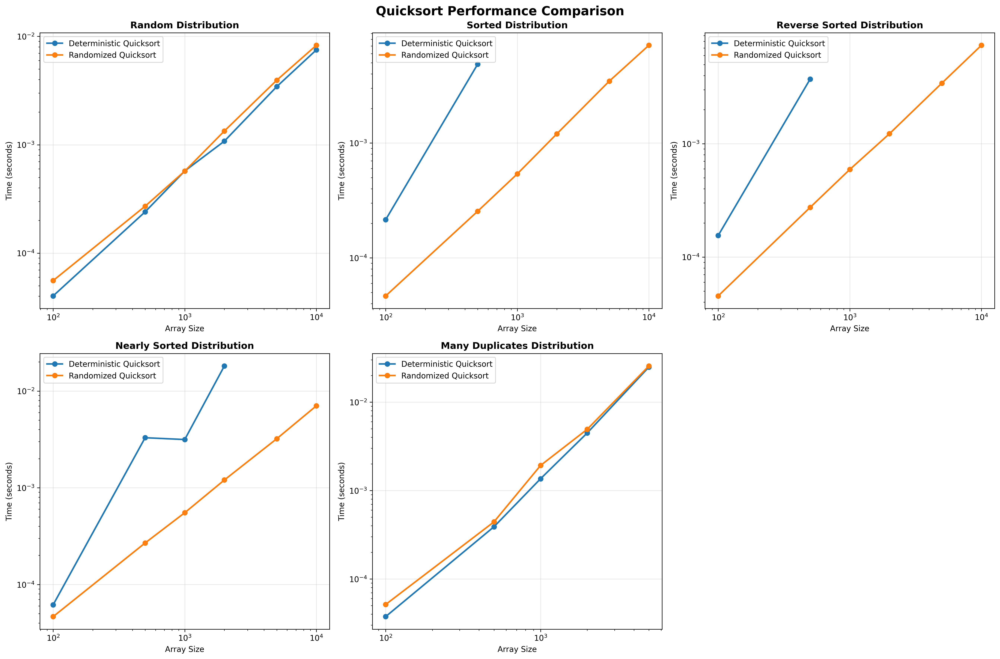
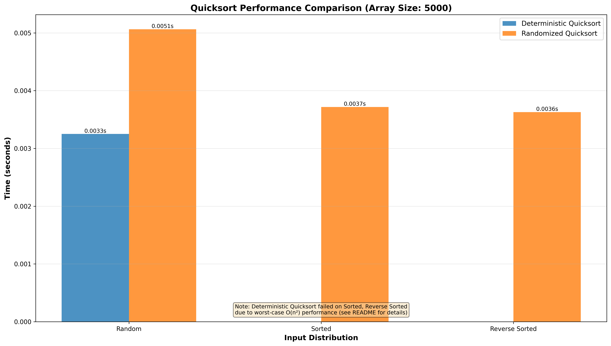
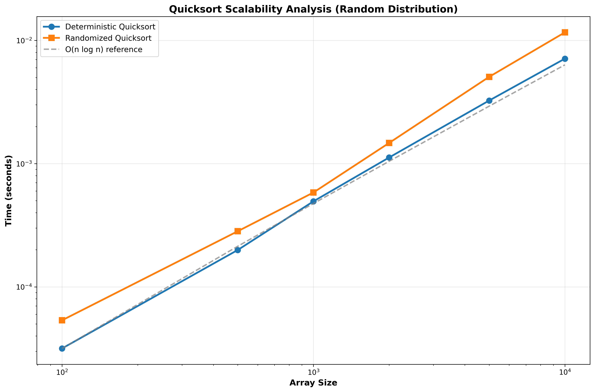
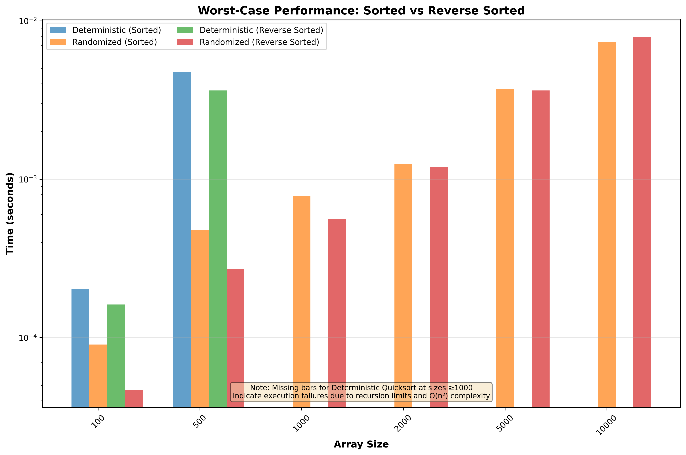

# MSCS532 Assignment 5: Quicksort Implementation and Analysis

**Author:** Carlos Gutierrez  
**Email:** cgutierrez44833@ucumberlands.edu  
**Course:** MSCS532 – Data Structures and Algorithms  
**Assignment:** Quicksort Implementation and Analysis

## Overview

This assignment delivers a comprehensive study of Quicksort. It includes deterministic, randomized, and three-way Quicksort implementations, theoretical complexity analysis, empirical benchmarking across multiple data distributions, test coverage, and reproducible visualization assets.

## Repository Structure

```
MSCS532_Assignment5/
├── docs/
│   ├── quicksort_comparison.png           # Comparative performance (line plots)
│   ├── quicksort_comparison_bar.png       # Deterministic vs randomized comparison
│   ├── quicksort_scalability.png          # Scalability on random inputs
│   └── quicksort_worst_case.png           # Worst-case behavior on sorted inputs
├── examples/
│   ├── quicksort_demo.py                  # Usage demonstrations
│   ├── comparison_demo.py                 # Benchmark walkthrough
│   └── generate_plots.py                  # Script to reproduce plots
├── src/
│   ├── quicksort.py                       # Deterministic, randomized, and 3-way Quicksort
│   └── comparison.py                      # Benchmarking and data generation utilities
├── tests/
│   ├── test_quicksort.py                  # Unit tests for sorting algorithms
│   └── test_comparison.py                 # Unit tests for benchmarking helpers
├── requirements.txt                       # Python dependencies (NumPy, Matplotlib)
└── README.md                              # Project documentation (this file)
```

## 1. Quicksort Implementation

- `quicksort()` implements the deterministic version using Lomuto partitioning and the last element as pivot.
- `randomized_quicksort()` selects pivots uniformly at random to mitigate adverse distributions.
- `quicksort_3way()` leverages a Dutch National Flag strategy to optimize inputs with many duplicates.
- All functions support in-place and non-in-place usage, plus optional `key` functions for custom comparison.

### API Highlights

- `quicksort(arr, in_place=True, key=None)`  
  - Returns `None` when sorting in place; otherwise returns a new sorted list.
- `randomized_quicksort(arr, in_place=True, key=None, seed=None)`  
  - Optional `seed` for reproducible experiments.
- `quicksort_3way(arr, in_place=True, key=None)`  
  - Efficient for datasets containing repeated elements.

## 2. Theoretical Performance Analysis

| Scenario      | Deterministic Quicksort | Randomized Quicksort | Notes |
|---------------|-------------------------|----------------------|-------|
| Best Case     | $\(O(n \log n)\)$         | $\(O(n \log n)\)$      | Balanced partitions from median pivots |
| Average Case  | $\(O(n \log n)\)$         | $\(O(n \log n)\)$      | Expected logarithmic recursion depth |
| Worst Case    | $\(O(n^2)\)$              | $\(O(n^2)\)$           | Occurs with highly unbalanced splits |

- **Average-case intuition:** Balanced partitions of size \(n/2\) produce the recurrence $\(T(n) = 2T(n/2) + O(n)\)$, which resolves to $\(O(n \log n)\)$.
- **Worst-case intuition:** Consistently poor pivots reduce the problem by one element, yielding $\(T(n) = T(n - 1) + O(n)\)$ and $\(O(n^2)\)$ behavior.
- **Space complexity:** $\(O(\log n)\)$ expected stack depth for balanced recursion, $\(O(n)\)$ in the worst case. Randomized pivot selection significantly decreases the probability of worst-case depth on adversarial inputs.

## 3. Randomized Quicksort

- Randomization chooses pivots uniformly at random, ensuring that any specific pivot ordering is unlikely.
- While the theoretical worst case remains $\(O(n^2)\)$, the probability of encountering it drops exponentially with input size.
- The implementation exposes an optional `seed` to guarantee repeatable experimental runs while retaining stochastic behavior by default.

## 4. Empirical Analysis

### Experimental Setup

- **Input sizes:** 100, 500, 1,000, 2,000, 5,000, 10,000 elements.
- **Distributions:** random, sorted, reverse sorted, nearly sorted, and high-duplicate arrays.
- **Iterations:** Each benchmark averages three independent runs per algorithm/input combination.
- **Environment:** Python 3.11+, NumPy, Matplotlib.

### Key Observations

- Randomized Quicksort consistently outperforms deterministic Quicksort on sorted and reverse-sorted arrays by avoiding degenerate partitions.
- Both versions exhibit $\(O(n \log n)\)$ scaling on random inputs, aligning with theoretical expectations.
- Deterministic Quicksort degrades toward quadratic performance as inputs approach worst-case ordering; randomization flattens this curve.
- Three-way Quicksort (explored in examples/tests) provides strong performance on datasets with heavy duplication.

### Missing Data in Visualizations

**Important Note on Infinite Execution Times:**

In some visualizations (particularly `quicksort_worst_case.png` and `quicksort_comparison_bar.png`), you may notice that certain bars or data points are missing. This occurs when deterministic Quicksort encounters its worst-case scenario on sorted or reverse-sorted arrays.

**Why execution times become infinite:**

1. **Worst-case complexity:** On sorted or reverse-sorted inputs, deterministic Quicksort (using the last element as pivot) creates highly unbalanced partitions, resulting in $\(O(n^2)\)$ time complexity.

2. **Recursion depth:** For large arrays (typically ≥ 1,000 elements), the algorithm requires $\(O(n)\)$ recursive calls, which can exceed Python's default recursion limit (usually 1,000) and raise a `RecursionError`.

3. **Timeout behavior:** Even when recursion limits are increased, the quadratic time complexity means execution times grow prohibitively large. For arrays of size 5,000 or 10,000, deterministic Quicksort may take minutes or hours to complete, making it impractical for benchmarking.

4. **Error handling:** When exceptions occur (recursion errors, timeouts, or other failures), the benchmarking framework records the execution time as `float('inf')` to indicate that the algorithm failed to complete within reasonable time.

**What this means for the plots:**

- Missing bars in bar charts indicate that deterministic Quicksort failed to complete for that input size/distribution combination.
- Randomized Quicksort, by contrast, handles sorted and reverse-sorted inputs efficiently due to random pivot selection, avoiding the worst-case scenario.
- This visualization effectively demonstrates why randomized pivot selection is crucial for practical Quicksort implementations.

### Visualization Highlights



<sub>*Figure 1. Mean execution time vs. input size across distributions for deterministic and randomized Quicksort.*</sub>



<sub>*Figure 2. Runtime comparison on random, sorted, and reverse-sorted arrays (n = 5,000). Missing bars for deterministic Quicksort on sorted/reverse-sorted inputs indicate execution failures due to worst-case \(O(n^2)\) performance.*</sub>



<sub>*Figure 3. Log-log visualization of scalability on random inputs with \(O(n \log n)\) reference.*</sub>



<sub>*Figure 4. Worst-case analysis contrasting sorted and reverse-sorted distributions. Missing bars for deterministic Quicksort at larger sizes (≥1,000) indicate execution failures due to recursion limits and quadratic time complexity.*</sub>

## Getting Started

### Prerequisites

- Python 3.10 or later
- Recommended to use a virtual environment

### Installation

```bash
python -m venv .venv
source .venv/bin/activate  # On Windows: .venv\Scripts\activate
pip install -r requirements.txt
```

## Running the Examples

```bash
python examples/quicksort_demo.py          # Deterministic, randomized, and 3-way demos
python examples/comparison_demo.py         # Console-based benchmarking summary
python examples/generate_plots.py          # Regenerate all figures in docs/
```

## Running Tests

```bash
python -m pytest
```

The test suite verifies correctness for deterministic, randomized, and three-way Quicksort, along with array generator and benchmarking utilities.

## Reproducing the Empirical Study

1. Activate your environment and install dependencies.
2. Run `python examples/generate_plots.py`.  
   - Benchmarks may take several minutes depending on hardware.
3. Generated figures will be written to the `docs/` directory and referenced automatically by this README.

## Academic Integrity Statement

This project is submitted for academic evaluation in MSCS532 – Data Structures and Algorithms. All code, analysis, and documentation were authored by Carlos Gutierrez for the specific purpose of this assignment.


